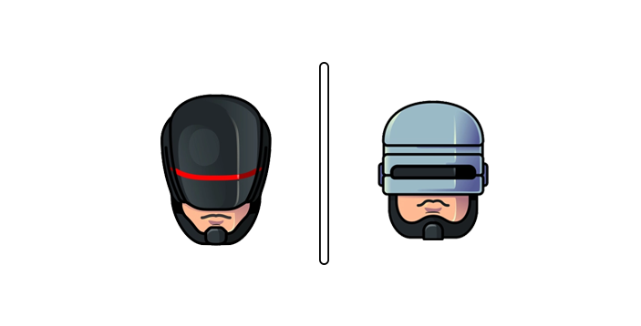

  

<h2 align="center">reepo-cop</h2>
<h4 align="center">A Probot Application to help <strong>police</strong> your repository</h4>

---

This aims to help standardize and automate your repository management in a way that helps you save time and effort, allowing you to focus on your projects than the minutae of administration.

## Some Features
- Automated Issue / Pull Request Labelling
  - **Issues**: Autoamtically labels your issues using keywords in the title of your issues.
  - **Pull Requests**: Automatically labels your Pull Requests based on their status (i.e. Draft / Ready for Review) **&** updates your Pull Requests with an `aspect.*` label based on the issue it is fixing / closing OR your own classification in the Pull Request body.

- Automatic Changelog Updating
  - Updates your Changelogs on a Draft Release based on merged pull requests between your last release and current release. (Uses `aspect.*` labels given to your PRs as headers).

A more in-depth description of the Bot's Features can be found in the [features](./docs/features.md) document.

---

  Feel free to fork this and customize it to your own needs 😃

## Useful Links
- [reepo-cop repository](https://github.com/reepo-bots/reepo-cop)
- [reepo-cop app site](https://github.com/apps/reepo-cop)
- [reepo-cop-beta repository](https://github.com/reepo-bots/reepo-cop-beta)
- [reepo-cop-beta app site](https://github.com/apps/reepo-cop-beta)

## Reference Docs
- [features](./docs/features.md)
- [reepo-cop's development](./docs/dev.md)
- [Probot Bootstrap Doc](./docs/probot_doc.md)
