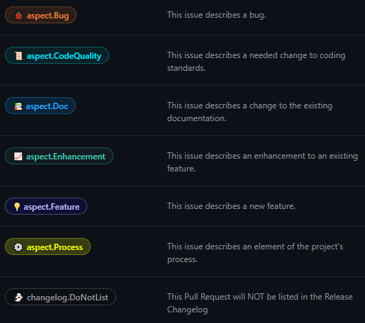
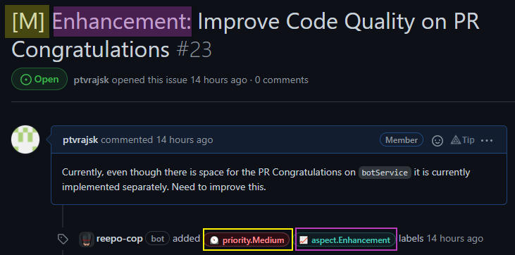
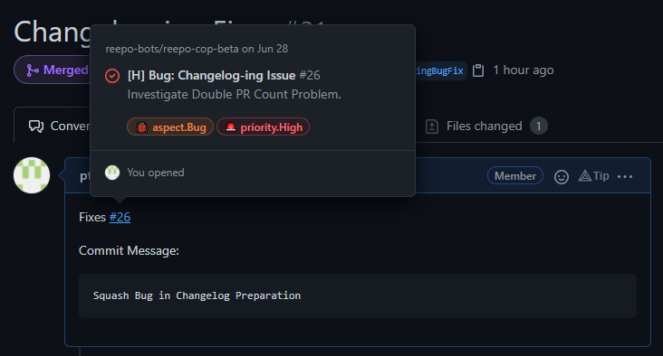
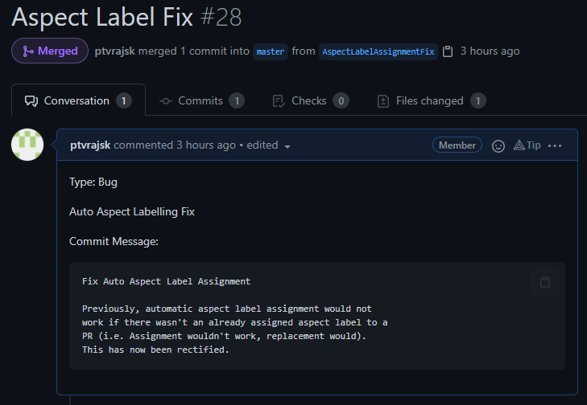
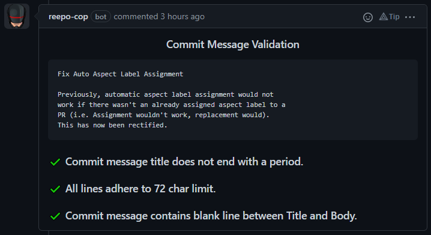
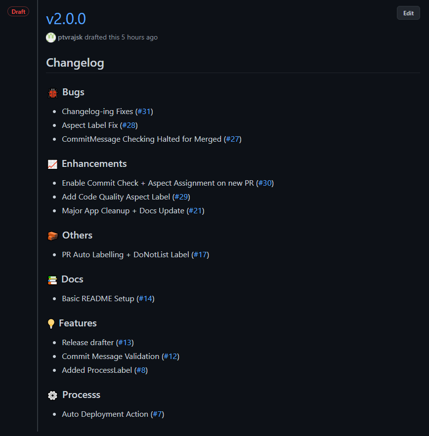

# Features

*reepo-cop* aims to exists as a supplmentary tool that assists the organization of the repository as opposed to forcing conformity. Most features are optional and you need not worry if you do not exactly adhere to the standards set by the bot (though you are encouraged to).

## Labels

  ### Synchronising Labels

  *reepo-cop* synchronises a list of frequently used preset labels accross all installed repositories.

  <p align="center">
    
  </p>

## Issues

  ### Automated Label Assignment

  *reepo-cop* automatically assigns a `priority.*` and `aspect.*` label on Issues if the title of the Issue conforms to a particular format.
  
  To assign a `priority` label, we prefix the Issue Title with the first letter of the priority code (i.e. `H` for `High`, `M` for `Medium`, ... ) within square brackets (`[]`).

  To assign an `aspect` label, we prefix the Issue Title with the aspect type (i.e. `Bug`, `Doc`, `Enhancement`, ... ).

  <p align="center">
    
  </p>


## Pull Requests

  ### Automated Label Assignment

  *reepo-cop* automatically assigns a `pr.*` and `aspect.*` label on Pull Requests.
  
  An `aspect.*` if an issue is linked using the `Fixes #{Issue Number}` in the body or a type is specified using the `Type: {Aspect}`. (NOTE: *reepo-cop* analyzes the first line of the Pull Request body for label assignment.)

  A `pr.*` label is assigned based on the status of the Pull Request (i.e. `pr.ToReview` if a PR is open, `pr.Ongoing` if PR is a draft).

  <p align="center">
    
    
  </p>

  <p align="center" style="font-size: 30px;">
    OR
  </p>
  
  <p align="center">
    
  </p>


  ### Automated Commit Message Validation

  *reepo-cop* automatically validates any proposed commit message on the Pull Request Body according to some of the [se-edu guidelines](https://se-education.org/guides/conventions/git.html). Commit Message proposal must adhere to the format of,
  
  ```
  Commit Message:
  ` ` `
  ` ` `
  ```
  (Without spaces in the tag to trigger code block)

  Anything can be written before and after so long as the message is enclosed in the (`) tags.

  Message Validation occurs when the PR is Ready For Review. Validation also only occurs whenever the proposed commit messages changes (i.e. No double validation if the Proposed Commit Message stays constant).

  <p align="center">
    
  </p>

## Releases

  ### Draft-Release Changelog

  *reepo-cop* automatically generates a changelog when a Draft Release is created. This is done by collating merged PRs after the last release (if one exists) and grouping them according to their aspect labelling (which should have been automatically or manually handled as described earlier.)

  This changelog is only created once when the Draft Release is made, so feel free to edit it after.

  Also note, Un-labelled Pull Requests are placed under the 'Others' Category.

  <p align="center">
    
  </p>
    

   